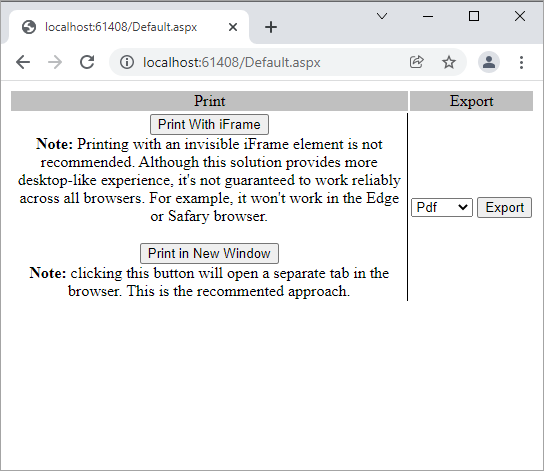

<!-- default badges list -->

<!-- default badges end -->
# Reporting for ASP.NET WebForms - How to print or export a report without showing a preview

This example demonstrates how to print or export a report in an ASP.NET WebForms application without displaying this report's preview.

The report uses one of the **ExportTo...** methods to export a report document to the page's **Response**.

To print the report, export it to the PDF format. Then write the PDF stream to the page's **Response** with the **Content-Disposition** header set to the "inline" value. The browser's built-in PDF viewer opens the PDF file. An alternative method exports the PDF to a separate iframe. In this case, only the print dialog is displayed.

## Files to Look At

- [Default.aspx.cs](CS/T227361/Default.aspx.cs) (VB: [Default.aspx.vb](VB/T227361/Default.aspx.vb))
- [Default.aspx](CS/T227361/Default.aspx) (VB: [Default.aspx](VB/T227361/Default.aspx))

## Documentation

- [Printing and Export in Reporting Tools for Web](https://docs.devexpress.com/XtraReports/404502/web-reporting/common-features/printing)

## More Examples

* [Reporting for ASP.NET MVC - How to print or export a report without showing a preview](https://github.com/DevExpress-Examples/reporting-print-export-report-without-showing-a-preview)
* [How to Print and Export a Report in the ASP.NET Core Application without the Document Viewer](https://github.com/DevExpress-Examples/Reporting-AspNetCore-Print-Without-Preview)
* [How to print and export DevExpress reports without previewing them on a web page in an ASP.NET Core Angular application](https://github.com/DevExpress-Examples/Reporting-Angular-Print-Without-Preview)
<!-- feedback -->
## Does this example address your development requirements/objectives?

 

(you will be redirected to DevExpress.com to submit your response)
<!-- feedback end -->
